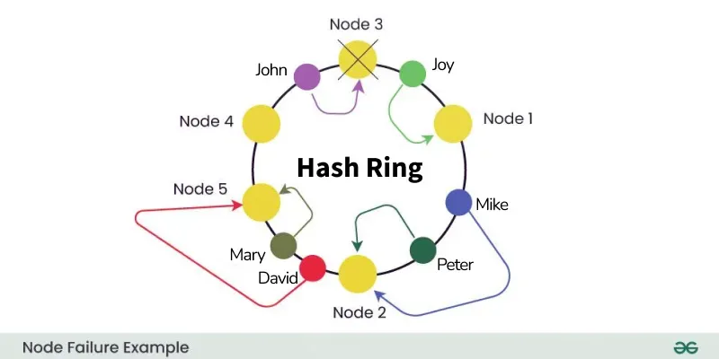

# What is the use of Consistent Hashing?

Consistent hashing is a popular technique in distributed systems to efficiently distribute keys or data elements across multiple nodes/servers. Its primary objective is to minimize the number of remapping operations when nodes are added or removed, enhancing system stability and reliability[web:60][web:62][web:65].

- It helps share the burden among  nodes and reduces the impact of node failures.
- When a new node is added, only a small subset of keys is remapped.
- If a node fails, only its specific keys are reassigned, reducing overall system disruption.
- Consistent hashing aids in data availability and consistency.

---

# Phases/Working of Consistent Hashing

1. **Hash Function Selection**  
   Choose a deterministic hash function to map keys and nodes to the ring[web:66][web:65].
2. **Node Assignment**  
   Place nodes on a circle (ring). Keys are assigned to the nearest node in the clockwise direction[web:60][web:62].
3. **Key Replication**  
   Data is replicated across multiple nodes for availability.
4. **Node Addition/Removal**  
   When nodes are added/removed, only relevant keys near the changed node are remapped, limiting overhead.
5. **Load Balancing**  
   Distributes keys evenly; overloaded nodes can offload some keys to others.
6. **Failure Recovery**  
   On failure, the ring is traversed to reassign keys to working nodes, maintaining data availability[web:64][web:65].

---

# Implementation Steps

1. **Choose a Hash Function**  
   Select an algorithm like MD5, SHA-1, or SHA-256 for uniform distribution.
2. **Define the Hash Ring**  
   Represent hash values as a circle, encompassing all possible outputs.
3. **Assign Nodes to the Ring**  
   Hash node IDs to position them on the ring.
4. **Key Mapping**  
   Hash keys; find their position and assign to the next node clockwise.
5. **Node Additions**  
   Add the new node, update the ring, and remap affected keys.
6. **Node Removals**  
   Remove the node, remap its keys to its successor.
7. **Load Balancing**  
   Periodically assess and redistribute keys for even distribution[web:60][web:62][web:65].

---

# Advantages of Consistent Hashing

- **Load Balancing:** Distributes data and requests evenly[web:65].
- **Scalability:** Easily adapts to changes in nodes or data without major performance loss[web:60][web:63].
- **Minimal Remapping:** Only a fraction of keys are affected by node changes[web:65].
- **Failure Tolerance:** Ensures reliable and available data by replicating and remapping keys when needed[web:64].
- **Simplified Operations:** Makes adding/removing nodes easy to administer.

---

# Disadvantages of Consistent Hashing

- **Hash Function Complexity:** The efficiency depends on a proper hash function[web:60].
- **Performance Cost:** Mapping, replication, and remapping consume resources.
- **Lack of Flexibility:** The system can be rigid in some edge cases.
- **High Resource Use:** Resource consumption may spike with large changes in nodes[web:60].
- **Management Complexity:** Requires expertise to manage and maintain distributed hash ring structures.

---

# Example

> 

---

# References

- [GeeksforGeeks - Consistent Hashing](https://www.geeksforgeeks.org/consistent-hashing-system-design/)
- [Ably - Consistent Hashing Explained](https://ably.com/topic/consistent-hashing)
- [Baeldung - What Is Consistent Hashing?](https://baeldung.com/cs/consistent-hashing)

